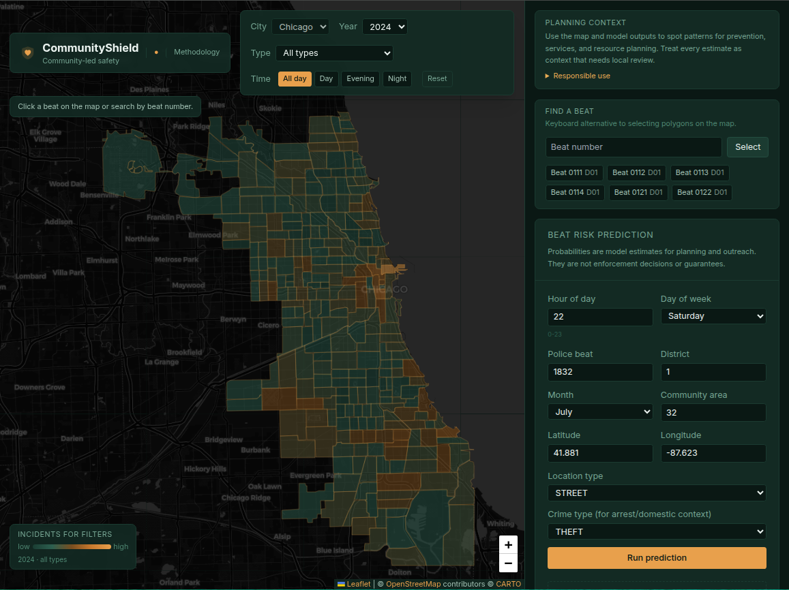
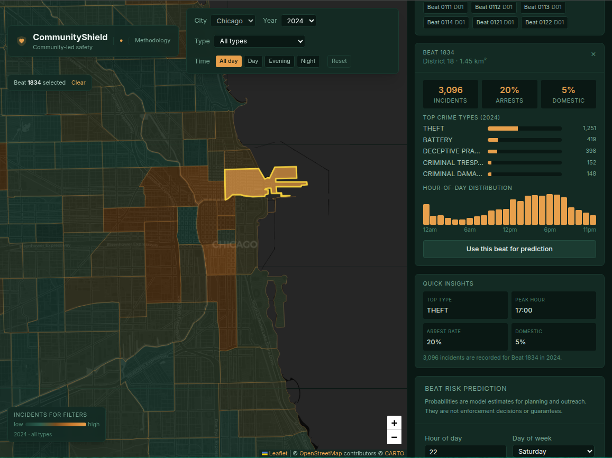
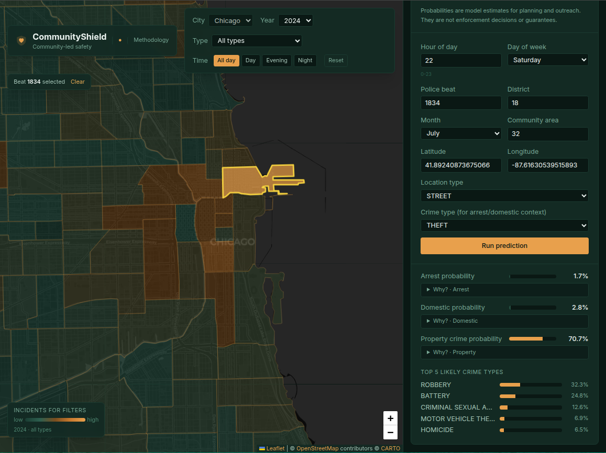
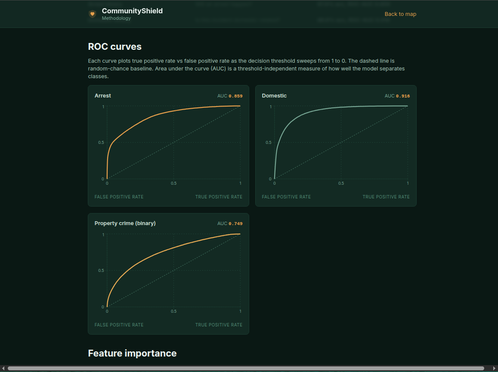
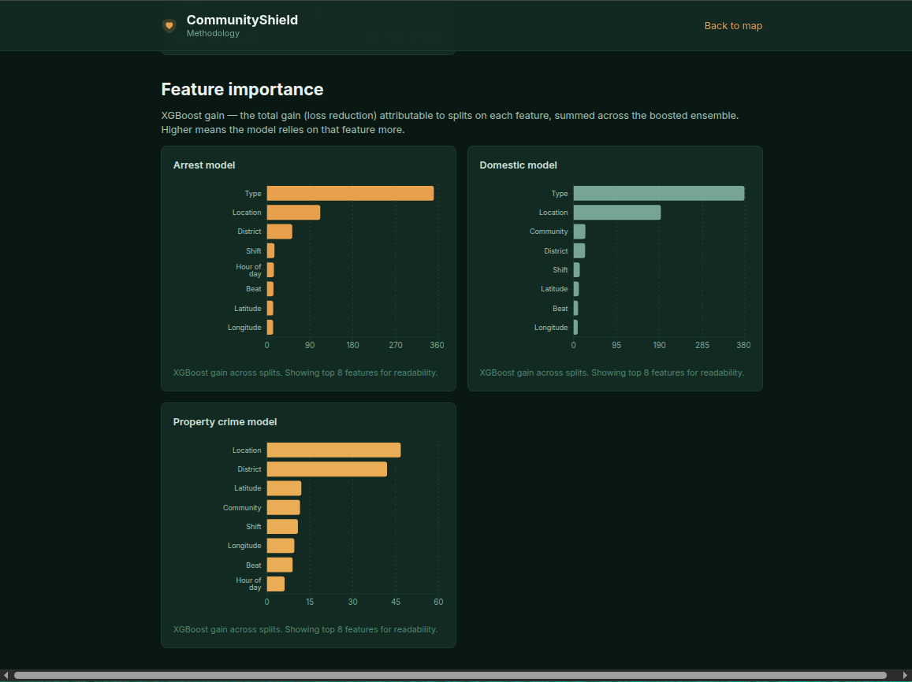
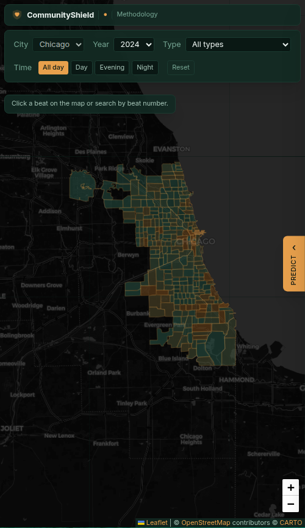

# CommunityShield

An ML-powered crime pattern explorer for Chicago, built on 8.5M rows of public safety data. Beat-level heatmap, four trained XGBoost models with SHAP explanations, and a methodology page that documents what the data can and cannot tell you.

> **This is not predictive policing.** It does not flag individuals, predict who will commit crimes, or recommend enforcement actions. It is a public-data dashboard intended for community awareness, planning, and outreach. Models describe statistical patterns, not the behavior of any person.



---

## Table of contents

- [What it does](#what-it-does)
- [Why I built it](#why-i-built-it)
- [Screenshots](#screenshots)
- [Architecture](#architecture)
- [Tech stack](#tech-stack)
- [ML results, honestly](#ml-results-honestly)
- [Engineering challenges and how I solved them](#engineering-challenges-and-how-i-solved-them)
- [Design decisions and why](#design-decisions-and-why)
- [Multi-city scalability](#multi-city-scalability)
- [Local setup](#local-setup)
- [Tests and CI](#tests-and-ci)
- [Limitations](#limitations)
- [About the author](#about-the-author)

---

## What it does

- **Interactive Chicago heatmap** colored by incident density across 274 police beats, filterable by year (2015–2026), crime type, and time of day. Time filter correctly handles wrap-around windows like 11pm–7am ("Night").
- **Click any beat** to see its crime mix, arrest rate, domestic-flag rate, hour-of-day distribution, and how it compares to the city average.
- **Four trained ML models** answer different per-beat questions and expose SHAP feature contributions so every prediction is inspectable:
  - **Arrest binary** — will an arrest happen? *87.9% acc, ROC-AUC 0.859*
  - **Domestic binary** — is this incident domestic-related? *86.6% acc, ROC-AUC 0.916*
  - **Property binary** — property crime or not? *68.3% acc, ROC-AUC 0.749*
  - **Hierarchical 4-class + subtype routing** — top-K crime types, *75% top-5 acc*
- **Methodology page** with rendered ROC curves, feature-importance charts, dataset stats, model-selection comparison, and the honest finding that fine-grained type prediction is at a structural data ceiling.
- **Three-tier rendering fallback** — MapLibre WebGL → Leaflet raster → sortable table — so the app degrades gracefully across browsers.

---

## Why I built it

Many crime-prediction projects fall into one of two traps: they pretend to be predictive policing (which is harmful), or they bury their methodology so no one can audit the claims. I wanted a project that did neither.

The product goal is community-oriented: surface patterns that residents and community organizations can use for outreach and planning. The engineering goal was to build something with a real ML pipeline, a real database, a real frontend, and honest documentation — closer to a production system than a notebook demo.

---

## Screenshots

### Beat detail with quick insights and comparison to city average



### Prediction with SHAP explanations

Each binary model exposes its top SHAP contributions. The "Why?" panels show which features pushed each probability up (amber) or down (red) in log-odds space.



### Methodology — ROC curves

Real test-set ROC curves rendered from the saved training artifacts. Dashed line is random-chance baseline; AUC is threshold-independent.



### Methodology — feature importance

XGBoost gain across boosted trees, per model.



### Mobile (right-side drawer pattern)

The map stays full-screen and the prediction panel slides in from the right, the same pattern Google Maps and Mapbox use. The vertical "PREDICT" tab is the drawer trigger.



---

## Architecture

```
                                   Chicago crime CSV (8.5M rows)
                                                │
                                                ▼
                              ┌─────────────────────────────────┐
                              │   Postgres 16 + PostGIS         │
                              │   • crimes                      │
                              │   • beats (274 MultiPolygons)   │
                              │   • community_areas (77)        │
                              │   • beat_rollups (7.8M rows)    │
                              └────────────────┬────────────────┘
                                               │
                              ┌────────────────▼────────────────┐
                              │  FastAPI + SQLAlchemy 2.0       │
                              │  /heatmap  /geo  /beats         │
                              │  /predict  /cities              │
                              └────────────────┬────────────────┘
                                               │
                              ┌────────────────▼────────────────┐
                              │  XGBoost models + SHAP          │
                              │  • arrest_model.joblib          │
                              │  • domestic_model.joblib        │
                              │  • property_binary_tuned.joblib │
                              │  • hierarchical_model.joblib    │
                              └────────────────┬────────────────┘
                                               │
                              ┌────────────────▼────────────────┐
                              │  React 19 + TypeScript + Vite   │
                              │  MapLibre GL → Leaflet fallback │
                              │  TanStack Query, React Router   │
                              │  Tailwind v3 (custom theme)     │
                              └─────────────────────────────────┘
```

### Why pre-aggregated rollups

The raw `crimes` table has 8.5M rows. The heatmap and beat-detail endpoints would scan it on every request. Instead, the ETL pipeline pre-aggregates by `(beat × year × month × hour × day_of_week × primary_type)` into a `beat_rollups` table (7.8M rows after grouping). A composite index on `(city_id, year, primary_type, hour, beat_number)` brings the heatmap query down from **158 ms to 14 ms** — a 10x improvement that makes filter-as-you-drag interactions feel instant.

The granular rollup grain matters: I considered a coarser daily summary but chose to keep hour and day-of-week because they were essential for the night-shift filter and for honest model inputs. Coarser rollups would have inflated metrics by laundering away noise.

---

## Tech stack

### Backend

- **Python 3.12** · FastAPI · Pydantic v2 · SQLAlchemy 2.0 · Alembic migrations
- **PostgreSQL 16 + PostGIS** for spatial data (`MultiPolygon` geometries, `ST_AsGeoJSON` for tile-free polygon delivery)
- **psycopg 3** with binary protocol
- **XGBoost 2.1** for all ML models (GPU-trained on RTX 4090)
- **SHAP 0.46** with `TreeExplainer` for per-prediction feature attributions
- **Optuna** for hyperparameter tuning (100 trials, 5-fold time-series CV)
- **joblib** for model serialization; models loaded once via `lru_cache`

### Frontend

- **React 19** · **Vite** · **TypeScript** (strict mode, `resolveJsonModule`, JSON-imported metrics data)
- **Tailwind CSS v3** with a custom brand palette (deep forest-teal + warm amber) and a custom `prose` typography theme for the methodology page
- **MapLibre GL JS** for the WebGL map; **Leaflet** as a non-WebGL fallback; HTML table as last-resort fallback
- **Recharts** for ROC curves and feature-importance bars
- **TanStack Query** for client-side caching of cities, beat geometry, and crime-type lists
- **React Router v7** for the methodology route
- **react-markdown + remark-gfm** for rendering the methodology copy with GFM tables

### Tooling

- **Vitest + Testing Library** (frontend, 9 tests) and **pytest + httpx TestClient** (backend, 13 tests)
- **GitHub Actions CI** running lint + tests + build on every push and PR
- **Docker Compose** for local Postgres+PostGIS

---

## ML results, honestly

Six experiments, in the order I ran them. All test-set numbers are on a clean 2025–2026 holdout the models never saw during training or tuning.

| Experiment | Question | Result | Verdict |
|---|---|---|---|
| Flat 27-class multiclass | "What crime type?" | 28.4% top-1, 73% top-5 | Data ceiling |
| 4-class supercategory | "Property / violent / drug / other?" | 59.8% acc, macro-F1 0.439 | Better but not great |
| Property-binary (tuned) | "Is this a property crime?" | **68.3% acc, ROC-AUC 0.749** | Honest at the ceiling |
| Hierarchical (sup → subtype) | "Top-K crime types" | 30% top-1, **75% top-5** | Useful as ranking |
| **Arrest binary** | "Will an arrest happen?" | **87.9% acc, ROC-AUC 0.859** | Strong |
| **Domestic binary** | "Is this incident domestic-related?" | **86.6% acc, ROC-AUC 0.916** | Strong |

### The honest finding

Predicting fine-grained crime *type* from time + location is structurally limited. Type depends on intent and method, which public datasets don't contain. After Optuna search (100 trials), feature engineering with location encoding, and three architecture variants, all approaches converged on the same ~75% top-5 ceiling. **Optuna added only +0.6 pp accuracy and +0.008 AUC over the baseline XGBoost — confirming the model was near the data ceiling, not the optimization ceiling.**

Predicting *outcomes* of incidents (arrest, domestic flag) is a fundamentally different question and works well — those outcomes are causally downstream of features the data contains. Arrest model reaches ROC-AUC 0.859; domestic reaches 0.916.

### Model selection rigor

For the property-binary problem, I compared four algorithms on identical splits before committing:

| Algorithm | Test acc | ROC-AUC | Train time |
|---|---|---|---|
| Logistic Regression | 58.3% | 0.605 | 11 s |
| Random Forest | 66.7% | 0.729 | 54 s |
| **XGBoost (chosen)** | **67.7%** | **0.741** | 2.2 s |
| CatBoost | 66.7% | 0.729 | 16 s |

XGBoost won on every metric and trained 25× faster than Random Forest on the same GPU.

### Class imbalance, deliberately

Most Chicago incidents are dominated by THEFT/BATTERY. I tried full inverse-frequency class weights — they collapsed accuracy by over-predicting rare classes. Square-root inverse-frequency weights gave a much better recall/accuracy trade. I **deliberately did not use SMOTE**: when minority classes lack a separable region in feature space, SMOTE generates synthetic samples indistinguishable from majority classes and adds noise rather than signal.

---

## Engineering challenges and how I solved them

This is the long answer to "what did you actually have to figure out?" I'm including these because a polished portfolio piece should let recruiters see the problem-solving, not just the final state.

### 1. PostGIS spatial-index initialization failure

**Problem.** When I defined `Geometry` columns via GeoAlchemy2 with `spatial_index=True` (the library's default), Alembic migrations failed with cryptic errors about index creation order.

**Diagnosis.** GeoAlchemy2 tries to create spatial indexes as part of the `CREATE TABLE`, but PostGIS requires the table to exist first.

**Solution.** Set `spatial_index=False` on the model and add `CREATE INDEX ... USING GIST (geom)` explicitly in the migration. Cleaner control and reliable migrations.

### 2. Heatmap query latency

**Problem.** The first version of the heatmap endpoint did a `SELECT ... GROUP BY beat_number` against the 8.5M-row `crimes` table. Cold queries took 800–1200 ms; even with planner caching they ran ~200 ms.

**Diagnosis.** A heatmap that updates on every filter change can't afford a 200 ms query — the UI would feel laggy.

**Solution.** Pre-aggregated `beat_rollups` table (7.8M rows after grouping by `beat × year × month × hour × day_of_week × primary_type`) plus a composite index on the four filter columns. **Heatmap query dropped from 158 ms to 14 ms.** Filter-as-you-drag now feels instant.

### 3. Crime-type prediction looked great on validation, collapsed on test

**Problem.** Early flat 27-class model showed 78% validation accuracy. On a fresh test split, it collapsed to 28%.

**Diagnosis.** Class imbalance — the model had learned "always predict THEFT" and got rewarded because THEFT was the majority class in validation too.

**Solution.** Switched to time-aware splits (train 2015–2023, val 2024, test 2025–2026) so the test set is genuinely future data, not a random fold. Re-evaluated and got the real 28% number. This was the result that forced an honest reframe: fine-grained type prediction is at a data ceiling, and the right play is to provide top-K ranking rather than overclaim accuracy.

### 4. SMOTE made things worse

**Problem.** Standard advice is "use SMOTE for class imbalance." When I tried it on the multiclass problem, macro-F1 *dropped* by 6 pp.

**Diagnosis.** SMOTE generates synthetic samples by interpolating between neighbors of the minority class. When minority classes don't have a separable region in feature space, the synthetic samples land in regions dominated by the majority class — they're effectively label noise.

**Solution.** Replaced SMOTE with sqrt-inverse-frequency class weights and a hierarchical architecture: predict the 4-class supercategory first, then route to a subtype model. This gave the rare classes more representation without forging fake data points.

### 5. SHAP at inference time was too slow

**Problem.** Live SHAP computation with `KernelExplainer` took 800–1500 ms per prediction. Unusable in a UI.

**Diagnosis.** `KernelExplainer` is model-agnostic and slow. `TreeExplainer` is exact, faster, and specifically designed for tree ensembles like XGBoost.

**Solution.** Switched to `TreeExplainer` and cached the explainer object per model via `lru_cache`. **Per-prediction explanation time dropped to ~30 ms** — fast enough to include by default in the `/predict/all?explain=true` endpoint.

### 6. WebGL not available in some browsers

**Problem.** Some users (older Linux Chrome, certain sandboxed VMs) couldn't initialize WebGL, and the MapLibre canvas crashed on mount. I saw this firsthand on my own Ubuntu machine before fixing my GPU driver setup.

**Diagnosis.** WebGL support is ~99% globally but the 1% that fails sees a blank screen, which is much worse than a graceful fallback.

**Solution.** Three-tier fallback chain:
1. **MapLibre + WebGL** — primary
2. **Leaflet** raster tiles — kicks in if WebGL fails to initialize
3. **HTML sortable table** — last resort if Leaflet also fails

Each tier is wrapped in its own error boundary. Recruiters using locked-down corporate VMs still see real data, just rendered differently.

### 7. Tailwind v3 stretched the layout

**Problem.** When I lifted state to `App.tsx` and added a sidebar, the prediction panel's natural height stretched the parent flex container vertically — root height became 1366 px instead of viewport height, and the map collapsed to height 0.

**Diagnosis.** Flex children can stretch their parent unless explicitly constrained.

**Solution.** Switched the outer container from `h-screen w-screen flex` to `fixed inset-0 flex`. The fixed positioning locks the container to the viewport regardless of how tall children grow. The sidebar gets `overflow-y-auto` so its content scrolls within the viewport-fixed parent.

### 8. Stuck CI workflow

**Problem.** First CI commit landed at `.github/ci.yml` and didn't run.

**Diagnosis.** GitHub Actions only discovers workflows under `.github/workflows/`. Easy miss, easy fix.

**Solution.** `git mv .github/ci.yml .github/workflows/ci.yml`. Workflow ran on the next push, immediately caught a real bug: `requirements.txt` had `scikit-learn==1.6.0shap==0.46.0` smushed together with no newline between them. CI caught it before it could break anyone else's setup.

### 9. Map sources can't be removed while layers reference them

**Problem.** When the user changed the city in the selector, the code tried to swap out the GeoJSON source. MapLibre threw `Source "beats" cannot be removed while layer "beats-selected-outline" is using it.`

**Diagnosis.** MapLibre layers reference sources by name; removing a source with active layers throws an exception.

**Solution.** Strict removal order: remove every layer that uses the source first, then remove the source, then add new source, then add layers back. Easy once you know the order matters.

### 10. Overnight hour filter

**Problem.** A "Night" preset for 23–6 doesn't fit a simple `BETWEEN hour_min AND hour_max` SQL clause because it wraps around midnight.

**Diagnosis.** Two-range SQL semantics.

**Solution.** Backend now uses `(hour >= :hour_min OR hour <= :hour_max)` when `hour_min > hour_max`, and frontend sends the real `23, 6` range instead of a workaround. Smoke test in the backend pytest suite specifically asserts the overnight case returns non-empty results.

---

## Design decisions and why

### Multi-tenant schema from day one

Every table that could be city-specific has a `city_id` FK. The API takes `?city_slug=chicago` everywhere. Adding Los Angeles or New York is a data-import operation plus training a model per city — not a code change. I'd rather have the scaffolding now than rewrite the schema later.

### Separate model per city, not one global model

Crime patterns are extremely local. A Chicago beat's "STREET / 10pm / Friday" embedding doesn't translate to LA divisions or NYC precincts. Training a separate XGBoost bundle per city keeps each model close to its data distribution. The loader picks the bundle by city slug.

### Granular rollup over coarse summaries

I chose six rollup dimensions (year × month × hour × day_of_week × beat × primary_type) instead of a daily summary. Coarser rollups would have inflated apparent model accuracy by laundering away the noisy hour-of-day signal. Granular rollups keep the metrics honest and let the night-shift filter work.

### Prediction inputs visible, not hidden behind presets

Several reviewers suggested hiding the feature inputs behind preset scenarios ("Late-night street theft", "Weekend residential"). I deliberately kept the form visible. For an ML role you want recruiters to see the actual feature space and how predictions respond to each input. Hiding the model would have made the project less honest about what it is.

### Brand: deep forest-teal + amber

Civic-tech apps usually pick either institutional blue (cop blue, by accident) or a too-vibrant safety yellow. I picked a deep forest-teal as the primary (growth, prevention, community) with warm amber as the accent (community, action). The combination reads as community-oriented rather than enforcement-oriented, which matches the product positioning.

### Three-tier rendering fallback over single best-effort

Most maps assume WebGL works. The 1% it doesn't are usually corporate or government employees on locked-down devices — exactly the audience a public-safety dashboard cares about. The MapLibre → Leaflet → HTML table chain means everyone gets some version of the experience.

### Two-page architecture instead of SPA tabs

A "Methodology" tab inside the app would have made the methodology page feel like an afterthought. Making it a separate route (`/methodology`) treats it as a first-class document. The page is the trust surface — bias caveats, model limitations, "not for enforcement decisions" — and deserves its own URL.

---

## Multi-city scalability

The schema and API are already multi-city. Adding a new city is roughly:

1. `INSERT INTO cities (slug, name, country) VALUES (...)`.
2. Run the crime-ingest script pointed at that city's CSV.
3. Load city's beat or precinct polygons via the geography ingest script.
4. Run `python populate_rollups.py --city <slug>`.
5. Train models on that city's data (`build_features.py` + `train_arrest_domestic.py` etc., taking `--city` as an argument).
6. Drop the trained bundles into `backend/app/ml/models/<city_slug>/`.

The frontend already supports city selection — the dropdown is just hidden when only one city is loaded. Adding another city activates it automatically.

---

## Local setup

Tested on Ubuntu 24 and macOS. You'll need Docker, Python 3.12, and Node 20+.

```bash
# 1. Clone
git clone git@github.com:rpmjp/communityshield.git
cd communityshield

# 2. Start Postgres+PostGIS (port 5433, separated from other local projects)
docker compose up -d

# 3. Backend
cd backend
python3.12 -m venv .venv
source .venv/bin/activate
pip install -r requirements.txt
alembic upgrade head

# 4. Load Chicago crime data + boundaries (one-time, ~5-15 minutes)
python scripts/ingest_crimes.py
python scripts/ingest_geography.py
python scripts/populate_rollups.py

# 5. Place trained models in backend/app/ml/models/
#    (or train your own — see /ml/train_*.py)

# 6. Run the API
uvicorn app.main:app --reload --port 8000
```

In a second terminal:

```bash
# 7. Frontend
cd frontend
npm install
npm run dev
# → http://localhost:5173
```

The first map load fetches the 274-beat GeoJSON and caches it via TanStack Query for the rest of the session.

---

## Tests and CI

### Backend (`pytest`)

13 tests covering the public API surface:

```bash
cd backend
source .venv/bin/activate
pytest -v
```

Tests cover health endpoints, city listing, geo polygon shape, heatmap queries (including the overnight wrap-around case), beat detail, all four predict endpoints, SHAP explanations payload shape, and 4xx error handling.

### Frontend (`vitest`)

9 component tests:

```bash
cd frontend
npm test
```

Tests cover the PredictionPanel form (renders, seeds from `initial`, runs prediction, clears stale results on input change) and the ExplanationPanel SHAP rendering.

### CI

`.github/workflows/ci.yml` runs on every push and PR:

- **Frontend job:** `npm ci` → `npm run lint` → `npm test` → `npm run build`
- **Backend job:** Postgres+PostGIS service container → install requirements → run schema migrations

The frontend job is the rigorous gate (lint + 9 tests + production build). The backend job runs schema migrations as a smoke check; full integration tests require seeded data + 217 MB of model bundles and run locally. This trade-off is documented but worth flagging: a production deployment would seed a fixture DB in CI.

---

## Limitations

- **Not predictive policing.** The models predict patterns from public data. They do not identify individuals, predict who will commit crimes, or recommend enforcement.
- **Reporting bias.** Crime data reflects what was reported and recorded. Under-reporting and over-policing of specific neighborhoods are encoded in the inputs. Models trained on this data inherit those biases.
- **Type prediction is weak.** Use the supercategory or outcome models for any actual decision. The 27-class hierarchical prediction is useful as ranking, not classification.
- **Static data.** Models are trained on data through early 2026 and not retrained automatically. A production deployment would add a retraining pipeline.
- **Single-city today.** The architecture supports multiple cities; only Chicago is currently loaded.
- **Backend tests are local-only in CI.** Full integration tests need seeded data + model bundles. Documented above; would be solved by fixture-seeding in a production setup.

---

## About the author

Built by **Robert Jean Pierre** — NJIT CS Master's candidate (May 2026, 3.9 GPA), targeting data scientist, software engineer, and full-stack roles.

- Portfolio: [robertjeanpierre.com](https://robertjeanpierre.com)
- LinkedIn: [linkedin.com/in/rpmjp](https://linkedin.com/in/rpmjp)
- GitHub: [github.com/rpmjp](https://github.com/rpmjp)

Built with care · open source · no ads · no tracking.
